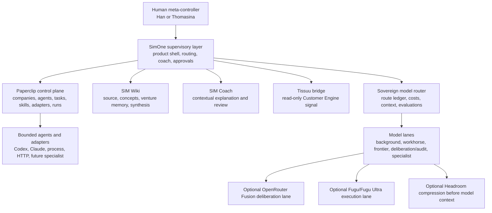
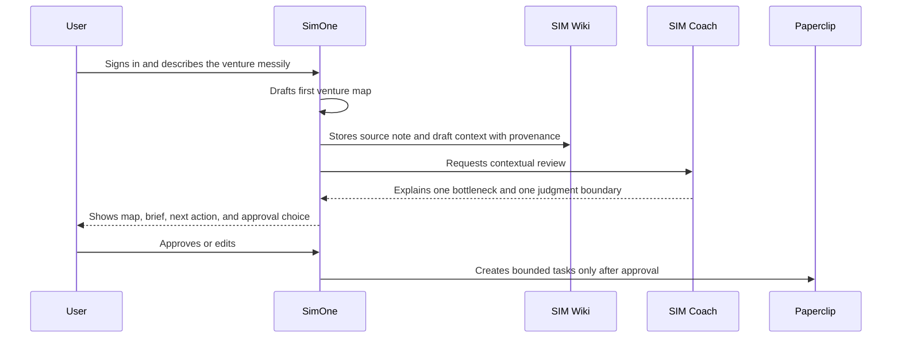
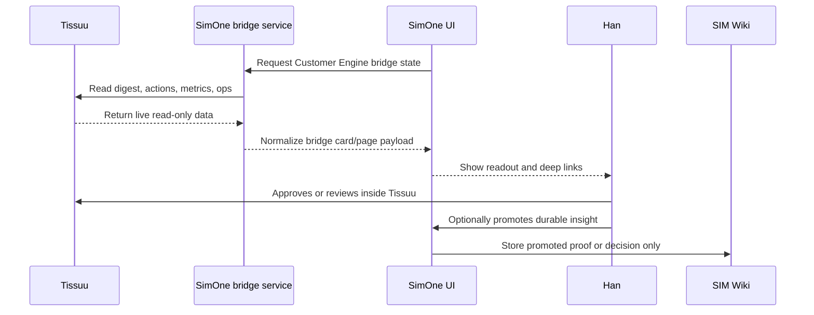
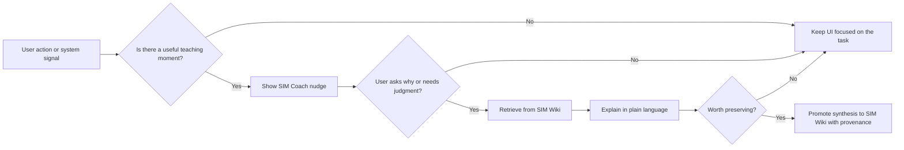
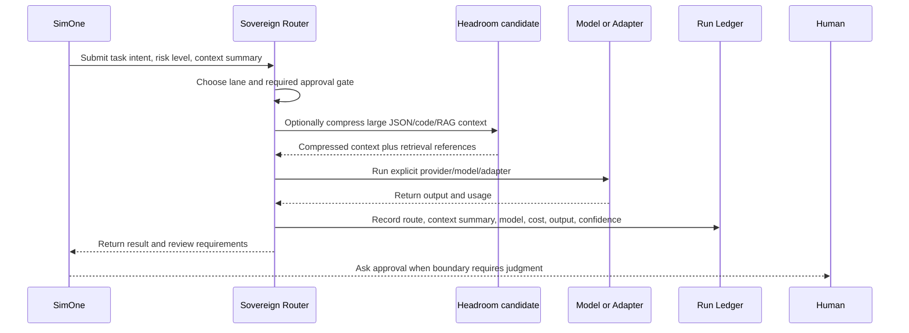
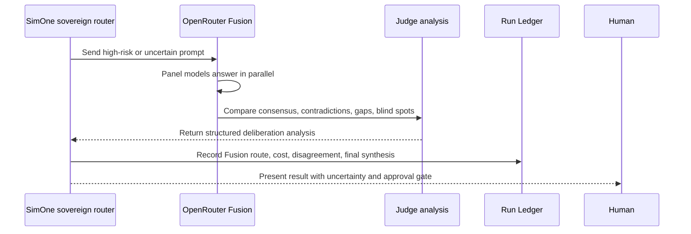
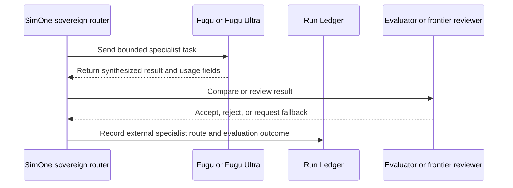
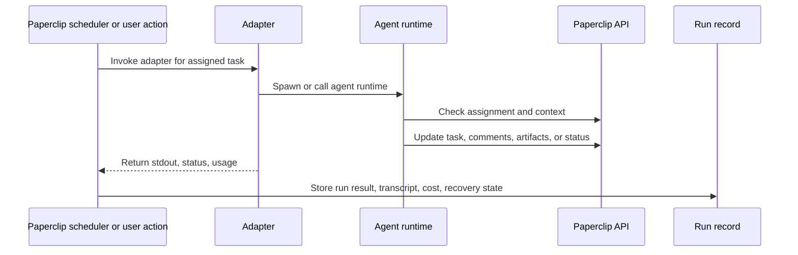

# SimOne Agent And Product Flows

Status: Living flow map
Date: 2026-07-08

## 1. Layer Map

Principle: the human keeps judgment, SimOne supervises and explains, Paperclip
coordinates work, agents execute bounded tasks.

## 2. SIM Starter Flow

Product rule: do not start by asking the user to manually fill all engines,
drivers, adapters, and model settings.

## 3. Tissuu Customer Engine Bridge Flow

Product rule: live counts and pending queues are ephemeral. Durable proof,
positioning, or relationship decisions may be promoted to SIM Wiki by an
explicit user action.

## 4. SIM Coach And SIM Wiki Interaction

Product rule: the coach should explain the method when it helps the user act,
not turn the app into a course ad.

## 5. Sovereign Model Routing Flow

Dev-mode rule: every important route should be inspectable before SimOne depends
on black-box orchestration.

## 6. Optional OpenRouter Fusion Deliberation Flow

Escalation rule: use Fusion when disagreement is informative and the cost of
being wrong is higher than the extra cost/latency of multiple model calls.

## 7. Optional Fugu Experiment Flow

Experiment rule: Fugu can be useful without becoming the root of trust. It must
sit behind SimOne's logs, evaluations, fallback rules, and human approval gates.

## 8. Paperclip Control-Plane Flow

SimOne product rule: keep this proven control-plane machinery where it works;
adapt the user's conceptual experience around it.

## 9. Approval Gates

Require human approval before:

- public claims or publishable artifacts
- customer/prospect outreach or mutation
- money, pricing, budget, or contract commitments
- deletion or irreversible data changes
- cross-engine tradeoffs
- governance or permissions changes
- model/provider spend-policy changes
- Tissuu bridge write-back, if v2 is ever built

Safe to delegate when:

- the task is bounded
- the context is scoped
- the output is reversible
- the route and cost are logged
- the result can be reviewed before external impact
